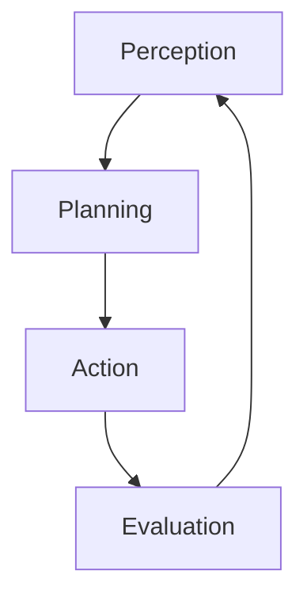

# Agentic RAG and Corrective RAG (CRAG)

Retrieving information to help generative AI is a delicate process. It is easy to get started with searches and vector searches, but it is hard to ensure the right data is loaded. **Agentic RAG** approaches bring in more power to load context to satisfy user requests and application goals.

In its most simple form, an agent performs the following loop:



Using generative AI and providing tools to the `Action` step, the agent is able to consume additional logic.

A **corrective retrieval-augmented generation (CRAG)** system reasons about the user request and the current context. It evaluates how supportive and useful the context is. If the context is sufficient to accomplish the task, the response is generated. Otherwise, the system will plan actions to cover the gap in the context.

A classic approach here is to try to use in-house data, often a vector search as in basic RAG. After evaluating the context relevance, the system may choose to supplement the missing parts by searching the web using a search engine like [Bing](https://www.bing.com). Alternatively the system may generate a better query to probe again within the RAG element. 

In this exercise you will build on top of the earlier [RAG chatbot and tool calling example](./6_RAGChatbot.md) to implement a CRAG system.

If you want to use the Bing search tool you will need to provision a Bing Search Service API key in Azure by following [these instructions](https://learn.microsoft.com/en-us/bing/search-apis/bing-web-search/create-bing-search-service-resource). As a simpler (but more limited) alternative you can use the class `DuckDuckGoSearchTool` provided in `DuckDuckGoSearchTool.cs` without any API key.

## Project setup

*Prerequisites: These instructions assume you've done earlier sessions, in particular session 1, which gives the basic environment setup steps.*

If you're not already running Qdrant, start it in Docker now:

```
docker run -p 6333:6333 -p 6334:6334 -v qdrant_storage:/qdrant/storage:z -d qdrant/qdrant
```
Check it is working by opening the [dashboard](http://localhost:6333/dashboard). It should contain a collection called `manuals`. If you want, you can visualize the points:


### Populating Qdrant

If your Qdrant Docker volume (`qdrant_storage`) already contains the sample PDF chunks because you did the [RAG Chatbot](6_RAGChatbot.md) session, you can skip this part.

Otherwise, populate your Qdrant storage as follows:

 * Open the project `exercises/RetrievalAugmentedGeneration/End` (and notice this path contains `End`, not `Begin`)
 * If you're using VS, ensure that `Ingestion` is marked as the startup project. For non-VS users, `Ingestion` is the project you should be ready to `dotnet run`.
 * Open `Program.cs`. Follow the instructions at the top, which explain how to:
   * Make sure Ollama is running and has the `all-minilm` model available
   * Make sure Qdrant, a vector database, is running in Docker

If you run the project, you should see it claim to ingest many PDFs. This will populate a collection in Qdrant. This might take a minute or two.

To learn more about how PDFs are ingested (i.e., how they are parsed, chunked, and embedded), you can refer back to the [RAG Chatbot](6_RAGChatbot.md) session.

### Starting services

Make sure you're running Ollama and that you have the `all-minilm` model available. If you're not sure, run:

```
ollama pull all-minilm
ollama serve
```

If `ollama serve` returns the error *tcp 127.0.0.1:11434: bind: Only one usage of each socket address*, be sure to first close any existing instance of Ollama (e.g., from the system tray on Windows) before running `ollama serve` again.

## Implementing the CRAG chatbot

Switch over to work on the CRAG project:

 * Open the project `exercises/CorrectiveRetrievalAugmentedGeneration/Begin`
 * For VS users, set `CorrectiveRetrievalAugmentedGenerationApp` as the startup project
 * Everyone else, prepare to `dotnet run` in the `CorrectiveRetrievalAugmentedGenerationApp` directory

In `Program.cs`, you'll see there's quite a lot of setup code. But none of this is a chatbot at all. It's just setting up an `IChatClient`, and `IEmbeddingGenerator`, and a `QdrantClient`.

Find where `IChatClient innerChatClient` is declared and make sure it's using the Azure OpenAI backend as we will require to perform structured parsing. While it's technically possible to achieve this with smaller models on Ollama, you would encounter reliability issues that would distract from the understanding of CRAG that this section aims to focus on.

### Ranking and filtering RAG results 

Inside `ChatbotThread.cs`, you'll see that `AnswerAsync` currently just performs a search operation over the manual chunks and then tries to generate an answer.

The approach here is *predetermined context* as seen in the [RAG Chatbot](6_RAGChatbot.md) sample. The code gets the 3 best matches it can find in the vector store.

We will take this further and use the LLM to evaluate how relevant are the chunks we have retrieved. 
The class `ContextRelevancyEvaluator` can help us ranking and filtering the chunks. 

When performing the semantic search we have found the closest matches using vector search. This is a similarity measure, not a measure of how relevant the chunks are to the user question.
Using an LLM to reason about *context relevancy* means to ask it to score how useful the context is to satisfying a user question.

Let's do it. Inside `ChatbotThread.cs`'s `AnswerAsync` method, replace these lines:

```cs
// For basic RAG, we just add *all* the chunks to context, ignoring relevancy
var chunksForResponseGeneration = closestChunksById.Values.ToDictionary(c => c.Id, c => c);
```

... with this improved alternative:

```cs
// For improved RAG, add only the truly relevant chunks to context
var chunksForResponseGeneration = new Dictionary<ulong, Chunk>();
ContextRelevancyEvaluator contextRelevancyEvaluator = new(chatClient);
double averageScore = 0;
foreach (var retrievedContext in closestChunksById.Values)
{
    var score = await contextRelevancyEvaluator.EvaluateAsync(userMessage, retrievedContext.Text, cancellationToken);
    if (score.ContextRelevance!.ScoreNumber >= 0.7)
    {
        averageScore += score.ContextRelevance!.ScoreNumber;
        chunksForResponseGeneration.Add(retrievedContext.Id, retrievedContext);
    }
}

averageScore /= chunksForResponseGeneration.Count;
```

You can use this code to filter the retrieved manual chunks to keep only those most relevant to the question, and to keep track of the overall relevancy of the final set.

### How re-ranking works

Inside `ContextRelevancyEvaluator.cs` we can see the logic used to ask the LLM to perform ranking:

```cs
public async Task<EvaluationResponse> EvaluateAsync(string question, string context, CancellationToken cancellationToken)
{
    // Assess the quality of the answer
    // Note that in reality, "relevance" should be based on *all* the context we supply to the LLM, not just the citation it selects
    var response = await chatClient.CompleteAsync<EvaluationResponse>($$"""
    There is an AI assistant that helps customer support staff to answer questions about products.
    You are evaluating the quality of the answer given by the AI assistant for the following question.

    <question>{{question}}</question>
    <context>{{context}}</context>

    You are to provide two scores:

    1. Score the relevance of <context> to <question>.
        Does <context> contain information that may answer <question>?


    Each score comes with a short justification, and must be one of the following labels:
        * Awful: it's completely unrelated to the target or contradicts it
        * Poor: it misses essential information from the target
        * Good: it includes the main information from the target, but misses smaller details
        * Perfect: it includes all important information from the target and does not contradict it

    Respond as JSON object of the form {
        "ContextRelevance": { "Justification": string, "ScoreLabel": string },
    }
    """, cancellationToken: cancellationToken);

    if (response.TryGetResult(out var score) && score.Populated)
    {
        return score;
    }

    throw new InvalidOperationException("Invalid response from the AI assistant");
}
```
Returning a structured object instead of a string makes it easier to integrate an LLM into traditional code.

### Correcting the aim

Now that we have discarded irrelevant context, we might need additional material. This is the corrective part of the algorithm. 
We might end with a `chunksForResponseGeneration` collection that does not contain enough (or any) material, so we need to find ways to improve it by adding more content.

There are few approaches possible. Some of the most common are:

1. **Query rewriting**
  
   [Query rewriting](https://medium.com/@florian_algo/advanced-rag-06-exploring-query-rewriting-23997297f2d1) takes the current available context and user question, and asks the LLM to generate new questions that could address the user's original goal. For example, we could generate five more questions (i.e., different phrasings of the user's goal) and use these to load more chunks from the vector store.

2. **HyDE (Hypothetical Document Embeddings)**

   Instead of generating hypothetical user inputs as above, [HyDE](https://medium.com/etoai/advanced-rag-precise-zero-shot-dense-retrieval-with-hyde-0946c54dfdcb) generates hypothetical documents to be indexed in your vector store.

   This is done using LLMs to generate hypothetical answers to queries. These answers are then turned into vector embeddings and placed in the same space as real documents. When a search is performed, the system may find these hypothetical documents, and if it does, the search results are amended to be the corresponding real documents from which the hypotheticals were derived.

*Query rewriting* and *HyDE* are closely related in that they both aim to improve retrieval by allowing for alternate ways to phrase things. A difference between the two is that query rewriting computes those alternatives at runtime during each query, whereas HyDE computes the alternatives just once up front.

### Reasoning in an agentic workflow

An agentic approach to *RAG* takes a different approach. An agent takes the initial context and objective and formulates a plan. Then, it executes a loop. On each iteration of the loop, the agent performs some action which can change the current context, which in turn may also change the current plan. The loop exits when the final objective is reached.

> [!ASIDE]
> If you want to learn more, read up on the [ReAct](https://docs.llamaindex.ai/en/stable/examples/agent/react_agent_with_query_engine/) and [Flare](https://docs.llamaindex.ai/en/stable/examples/query_engine/flare_query_engine/) retrieval approaches. These perform a single step of retrieval and try to explore the problem space one step at a time, reasoning about knowledge gaps that remain and how to retrieve more information to address such gaps. They have the benefit of using a limited number of tokens because as they loop, they mutate the current state without an overall vision. But as a drawback this risks getting into infinite loops because the agent doesn't know what has been already explored, is only focused on accomplishing the final goal.

We will be using a **Plan, Step, Eval** approach, so we can keep looking at the overall trajectory and what we have accomplished so far.

First let's break down few things we need to consider and use.

#### Making plans

LLMs can generate plans to accomplish a goal, giving us back a list of steps. A plan is structured information, so we want to represent it with strongly-typed C# objects. Each step might be represented as a different type of object (e.g., search a vector DB, search the web, run some code, etc.).

To assist with this, the example app includes a project called `StructuredPrediction` containing utilities to create an `IStructuredPredictor` from a `IChatClient`. This extends `CompleteAsync<T>` by being able to return multile different types instead of just one single type `T`.

#### Registering a search tool in DI

We'll give the agent the ability to fill in knowledge gaps by searching the web.

If you want to use the Bing Search API, first obtain an API key following the [these instructions](https://learn.microsoft.com/en-us/bing/search-apis/bing-web-search/create-bing-search-service-resource). It's free but does require a credit card to sign up. You can then add it to user secrets by running a command like the following in the directory containing `CorrectiveRetrievalAugmentedGenerationApp.csproj`:

```
dotnet user-secrets set BingSearch:Key yourKeyGoesHere
```

Finally, you can register the Bing search tool as a DI service in `Program.cs`:

```cs
builder.Services.AddSingleton<ISearchTool>(_ =>
    new BingSearchTool(builder.Configuration["BingSearch:Key"]!, new HttpClient()));
```

As an alternative to the Bing Search API, you can use the provided `DuckDuckGoSearchTool` by registering a DI service in `Program.cs` as follows:

```cs
builder.Services.AddSingleton<ISearchTool>(_ => new DuckDuckGoSearchTool(new HttpClient()));
```

This avoids the need for a Bing Search API key, but is much more limited. DuckDuckGo's API only returns results for simple queries, e.g., ones that match the name of a Wikipedia page.

#### Giving the chatbot access to the search tool

Update `Chatbot.cs` to introduce a dependency on the search tool. Modify its constructor like this:

```cs
public class Chatbot(
    IChatClient chatClient,
    IEmbeddingGenerator<string, Embedding<float>> embeddingGenerator,
    QdrantClient qdrantClient,
    ISearchTool searchTool)
    : IHostedService
```

In turn, pass this through to the `ChatbotThread` constructor:

```cs
ChatbotThread thread = new(chatClient, embeddingGenerator, qdrantClient, currentProduct, searchTool);
```

... and correspondingly update the `ChatbotThread` constructor to receive it:

```cs
public class ChatbotThread(
    IChatClient chatClient,
    IEmbeddingGenerator<string, Embedding<float>> embeddingGenerator,
    QdrantClient qdrantClient,
    Product currentProduct,
    ISearchTool searchTool)
```

Now we want to define a C# method that can be called by the LLM to perform a search. In `ChatbotThread`, add a further method:

```cs
private async Task<string> SearchWeb(
    [Description("The question we want to answer using a web search")] string userQuestion,
    CancellationToken cancellationToken = default)
{
    var results = await searchTool!.SearchWebAsync(userQuestion, 3, cancellationToken);

    foreach (SearchResult searchResult in results)
    {
        Console.ForegroundColor = ConsoleColor.Red;
        Console.WriteLine($"""
                            Corrective step using data from :{searchResult.Url}
                            Web Search: {userQuestion}
                            
                            Preview:
                            {searchResult.Snippet.Substring(0, Math.Min(100, searchResult.Snippet.Length))}....
                            
                            """);
    }

    return string.Join("\n", results.Select(c => $"""
        ## web page: {c.Url}
        # Content
        {c.Snippet}
        """));
}
```

#### Implementing the Corrective RAG loop

Finally we're ready to put in the logic that implements a corrective RAG loop. Inside `ChatbotThread`'s `AnswerAsync`, find the following comment:

```
// Now ask the chatbot
```

Immediately **before** that comment, add the following block of code. It's a big one, and implements everything we discussed above:

```cs
// Corrective RAG
if (chunksForResponseGeneration.Count == 0 || averageScore < 0.7)
{
    var planGenerator = new PlanGenerator(chatClient);
    var toolCallingClient = new FunctionInvokingChatClient(chatClient);
    var stepExecutor = new PlanExecutor(toolCallingClient);

    var evaluator = new PlanEvaluator(chatClient);

    string task = $"""
                    Given the <user_question>, search the product manuals for relevant information.
                    Look for information that may answer the question, and provide a response based on that information.
                    The <context> was not enough to answer the question. Find the information that can complement the context to address the user question.
                    
                    Take into account the user is enquiring about 
                    ProductId: ${currentProduct.ProductId}
                    Brand: ${currentProduct.Brand}
                    Model: ${currentProduct.Model}
                    Description: ${currentProduct.Description}

                    <user_question>
                    {userMessage}
                    </user_question>

                    <context>
                    {string.Join("\n", closestChunksById.Values.Select(c => $"<manual_extract id='{c.Id}'>{c.Text}</manual_extract>"))}
                    </context>
            """;

    List<PlanStepExecutionResult> pastSteps = [];
    var plan = await planGenerator.GeneratePlanAsync(task, cancellationToken);
    var options = new ChatOptions { Tools = [AIFunctionFactory.Create(SearchWeb)] };
    var maxSteps = plan.Steps.Length * 2;
    while (maxSteps > 0)
    {

        var res = await stepExecutor.ExecutePlanStep(plan, options: options, cancellationToken: cancellationToken);
        pastSteps.Add(res);

        var planOrResult = await evaluator.EvaluatePlanAsync(task, plan, pastSteps, cancellationToken);
        if (planOrResult.Plan is not null)
        {
            plan = planOrResult.Plan;
            maxSteps--;
        }
        else
        {
            // Add the result to context
            if (planOrResult.Result is { } result)
            {
                var maxKey = chunksForResponseGeneration.Count == 0 ? 0 : chunksForResponseGeneration.Keys.Max() ;
                var fakeId = maxKey + 1;
                chunksForResponseGeneration[fakeId] = new Chunk(
                    Id: fakeId,
                    Text: result.Outcome,
                    ProductId: currentProduct.ProductId,
                    PageNumber: 1
                );
            }

            break;
        }
    }
}
```

So, what does this do?

It checks whether the vector search results were sufficient to resolve the query directly. If not, it begins a CRAG loop in which an agent is instructed to formulate a plan to handle the query. On each loop, the agent is allowed to perform a web search and/or update its plan. The loop continues until a final `planOrResult.Result` is available. This final result is added to the context, and then the LLM continues by returning a final response to the user (including a possible citation).

We can use a combination of **reasoning** and **query rewriting** to rephrase the user question to probe in vector store in different ways too. Be careful that we still need to ensure we do not perform infinite loops.

This is an example of asking a question using the planner:

